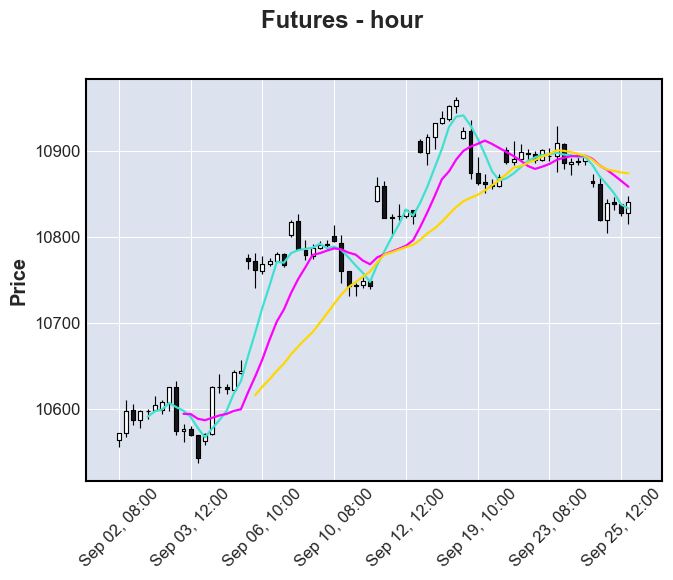

# 台灣期貨交易所 委託檔、成交檔、間隔揭示檔整合範例

### Python 資料整理流程
1. 個別整理：委託檔、成交檔、揭示檔
2. 利用 Key 串接委託檔與成交檔，以委託時間為主
3. 利用時間串接揭示檔與委託成交合併檔
整理邏輯：看見揭示檔後，投資人做出委託決策（以揭示檔時間為先）
4. 將成交檔 Tick Data 整理成任一區間的 OHLCV
5. 將成交資料繪製成靜態圖與動態圖

[圖示 每小時成交資訊](https://github.com/AlexChiang0208/Futures-Tidy-the-TickData/tree/main/%E7%B9%AA%E8%A3%BD%E5%9C%96%E7%89%87)

> 註：資料來源為任課老師所提供教學資料，因此未放在本篇Repository
> 
> 資料來源：台灣期貨交易所，日內交易資料
